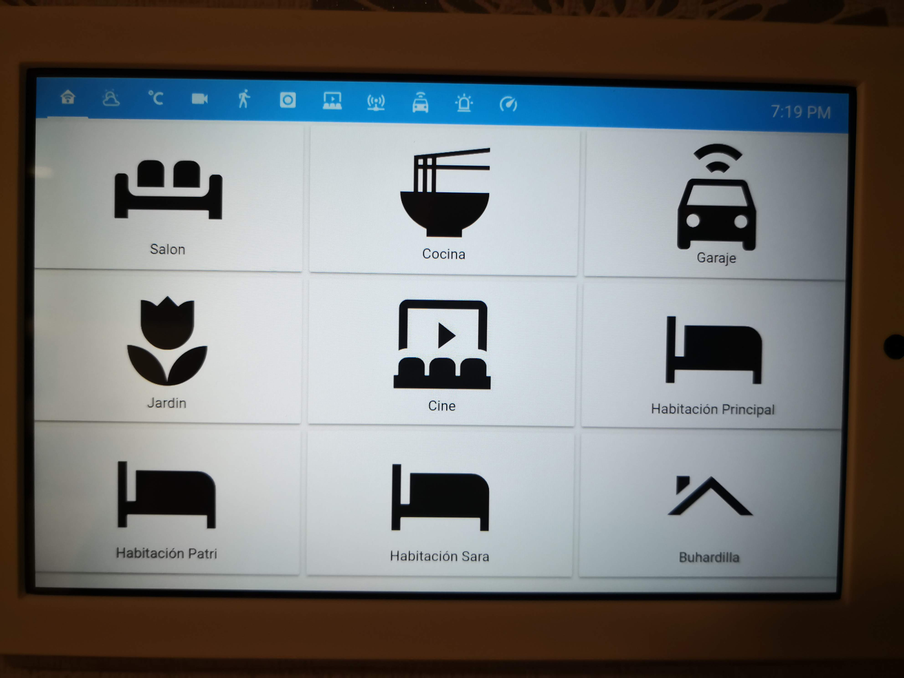
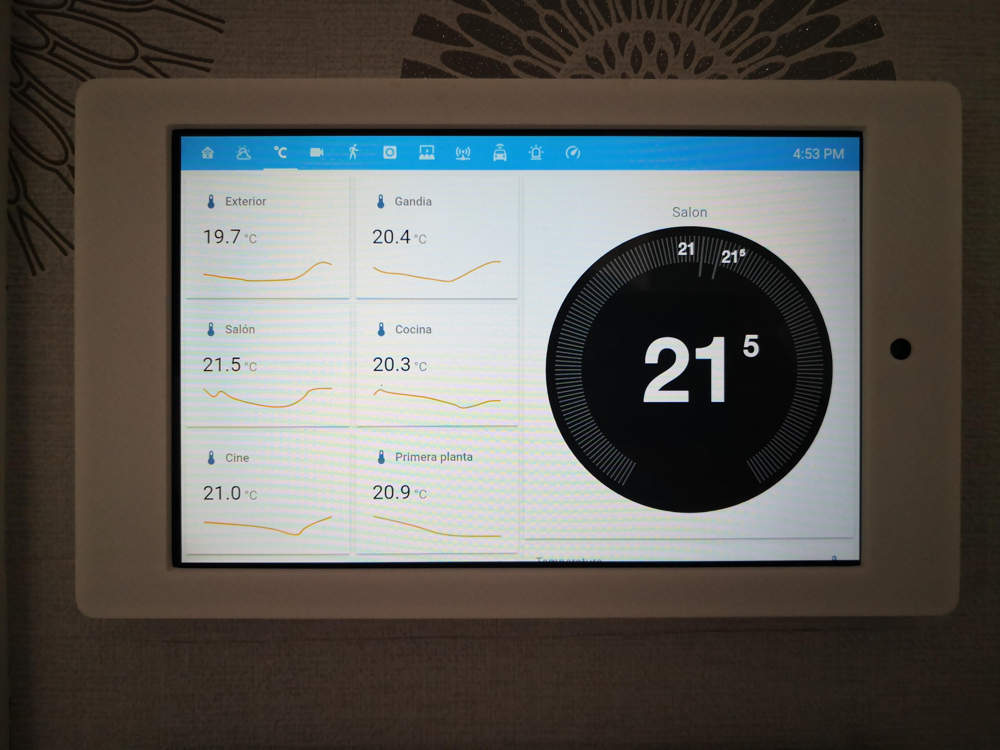
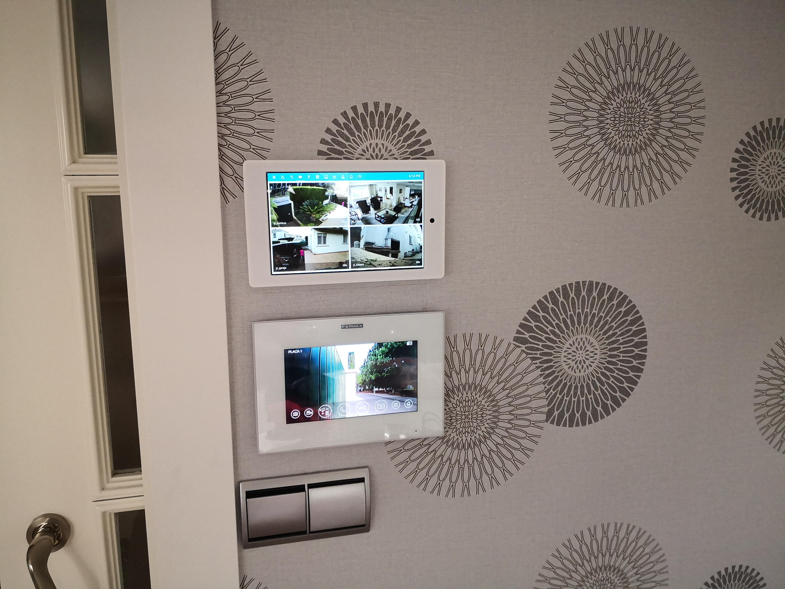

# Home-AssistantConfig
Here you are my quite standard Home Assistant configuration file. It's  got a standard front end .yaml and also a lovelace one. 
Part of its lovelace configuration is optimised for a control panel we've got in our kitchen. 
My systema has quite a lot of z-wave devices, including switches for lights (Qubino Flush 2 Relays), covers (Qubino Flush shutters) 
and PIR detection devices from NeoCoolcam. Other devices are a Nest Thermostat, sonos speakers, Harmony Hub, and several chromecast 
devices. Most of my automations are for lights and covers (up with the sunrise, down on sunset, or with detection). But what I like the 
most are the scripts for info and warnings  via TTS through our sonos speakers (i.e. good morning info, unexpected problems warnings(like 
garage door didn't close and the like)), which I set up with the help and shared config files  from some great people in HA community. I have yet to 
set up some more automations and scripts for my audio and video devices: Harmony hub, plex, chromecasts, etc.
Here you are some screenshots of the front end: 

